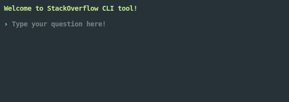
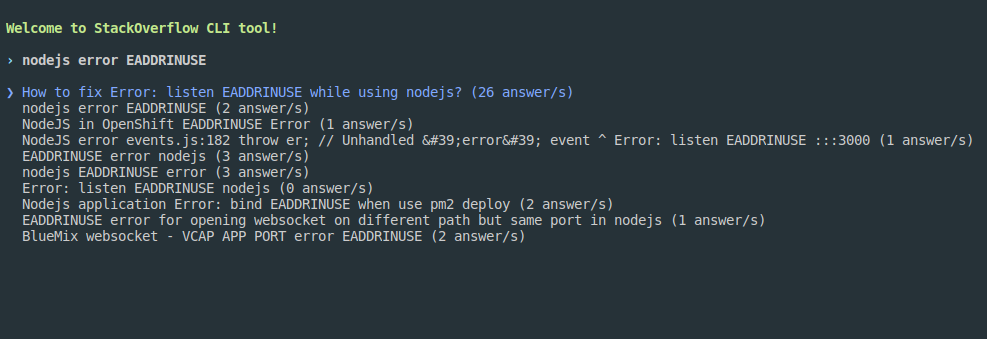

# stackoverflow-cli
A CLI tool to search in StackOverflow usign react in the terminal (**ink package**)

## Install
```js
npm i -g stackoverflow-cli
```

## Usage

type:
```js
stackoverflow-cli
```
and you will see the following screen in your console:


type your question (*nodejs error EADDRINUSE* in our case) and you will see something like this:


Move between the results and press *enter* to open a tab in your browser with your chosen option


